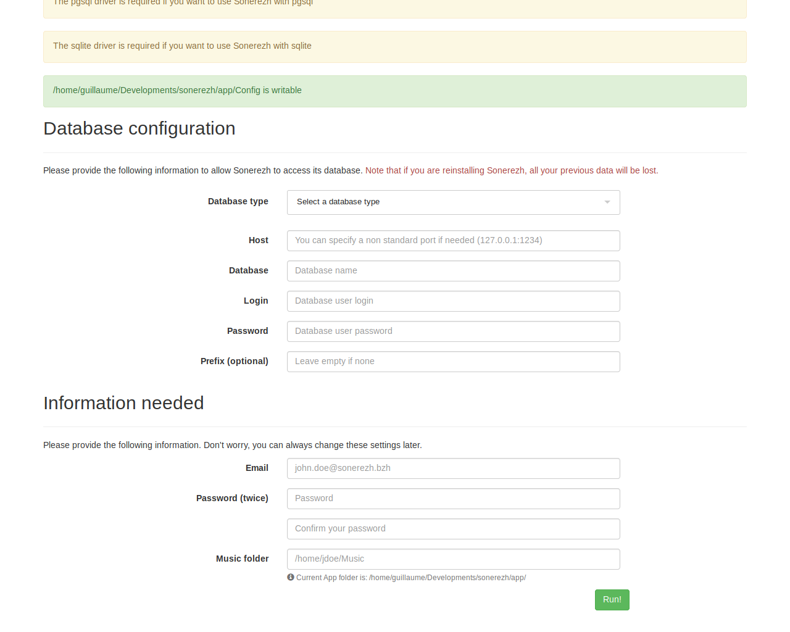

# Sonerezh

A self-hosted, web-based application to stream your music, everywhere.

---

## Overview

Sonerezh is a self-hosted, web-based audio streaming application allowing you
to access your music from anywhere, using your favorite web browser.

**Automatic import**

Tell Sonerezh where your music is stored and that's all. It will parse and
extract the metadata of each files to built its own database. We currently
support MP3 and MP4, OGG/Vorbis (.ogg and .flac) files.

**Beautiful Web-UI**

Browse you favorite music through several beautiful views, sort your collection
by band, album, date, etc.

**2-clicks installation**

Sonerezh is easy to install thanks to its automatic deployment tool. No
headaches with configuration files.

---

## Installation

Sonerezh is quite easy to install. All you need is:

- A web server (Apache2, Nginx...)
- PHP, with the following modules enabled: ``php-mysql`` and ``php-gd``
  (with ``exif.so``)
- A database (MySQL or MariaDB)
- Optionally ``avconv`` or ``ffmpeg`` if you plan to use the conversion tool

!!! Note

    This documentation will **NOT** cover the installation of NGINX or PHP. A lot
    of tutorials are already available on the web.
    
    However, configuration samples are available for NGINX or Apache.

### Get the latest stable release

The releases are published on [GitHub], but you should download the latest
stable release from _sonerezh.bzh_.

```sh
# Replace tar.gz with zip if needed.
$ wget https://www.sonerezh.bzh/downloads/latest.tar.gz
$ tar -zxf latest.tar.gz
```

### Prepare the database

The database must be created before you access Sonerezh for the first time.
A simple setup could be:

```sql
$ mysql -u root -p
mysql> CREATE DATABASE sonerezh;
mysql> GRANT ALL PRIVILEGES ON sonerezh.* TO 'sonerezh'@'localhost' IDENTIFIED BY '<changeme>';
mysql> FLUSH PRIVILEGES;
exit;
```

Where ``<changeme>`` is the password used by the MySQL user.

---

## Getting started

You may want to allow the web server system account to read this directory.
Usually its ``www-data``.

```sh
$ sudo chown -R www-data: sonerezh
```

Now you can go to ``http://127.0.0.1/install`` (or whatever configured domain
name) to set the database settings and create the first user.



If all goes well you should be redirected to the login page.

[GitHub]: (https://github.com/Sonerezh/sonerezh/releases)
